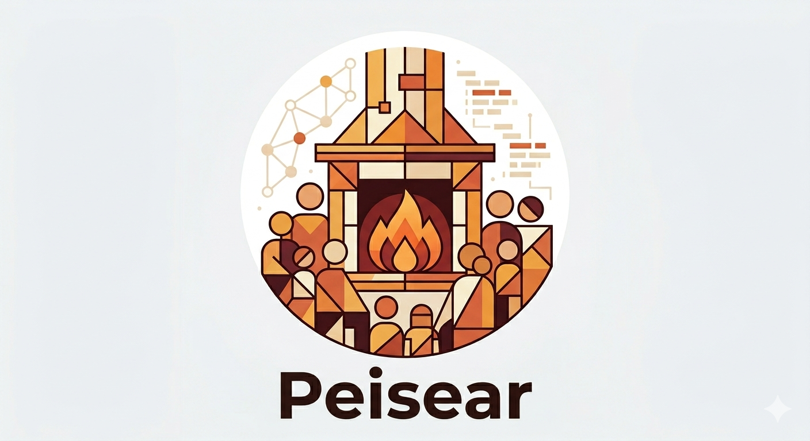

# Peisear

[](https://crates.io/crates/peisear)
[](https://docs.rs/peisear)
[](https://deps.rs/crate/peisear)
[](https://github.com/nabbisen/peisear/blob/main/LICENSE)



A minimal, self-hostable issue management system written in Rust (Edition 2024).

- **Sophisticated** — Typed domain model, server-side rendering, robust error handling with `IntoResponse`, argon2id password hashing, JWT sessions.
- **Solid** — `sqlx` parameterized queries (no string concatenation, no injection), `CHECK` constraints on enum columns, foreign keys with `ON DELETE CASCADE`, WAL-mode SQLite for concurrent reads.
- **Really Easy** — Single binary + a single `.db` file. No Node.js toolchain, no external services. Backups are just `cp app.db backup.db`.
- **Good UI/UX** — Tailwind + daisyUI, board/list toggle, drag-and-drop kanban, mobile-responsive layout.

## Stack

| Layer | Choice |
|---|---|
| Language | Rust 1.85+ (Edition 2024) |
| Web | `axum` 0.8 |
| Async | `tokio` |
| Storage | `sqlx` 0.8 + SQLite (WAL, FKs on) |
| Templates | `askama` 0.14 (compile-time, auto-escaping) + `askama_web` (axum-0.8 integration) |
| Styling | Tailwind CSS + daisyUI (via CDN by default) |
| Auth | `jsonwebtoken` 9, `argon2` 0.5, HTTP-only cookies |
| Validation | `validator` 0.18 |

## A note on Leptos

The original specification called for `leptos` with SSR + hydration. The full-stack Leptos build requires a `wasm32-unknown-unknown` Rust target. On systems where Rust is installed via `rustup` that is a single command (`rustup target add wasm32-unknown-unknown`), but the apt-packaged Rust 1.91 used during initial development on this codebase does not ship that target. Rather than block on toolchain issues, this implementation renders HTML server-side with **askama** (compile-time templates, identical XSS protection, same axum handlers) and does a small amount of browser-side interactivity in vanilla JS for the kanban drag-and-drop. The architecture — typed models, `AppError: IntoResponse`, `FromRequestParts` extractors, the split of `handlers/` vs `db/` vs `views` — is the same one a Leptos SSR app would want, so migration later is a layer swap rather than a rewrite. See **Migrating to Leptos** at the bottom.

## Project layout

```
peisear/
├── Cargo.toml
├── Cargo.lock
├── LICENSE-MIT
├── LICENSE-APACHE
├── README.md
├── .env.example
├── .gitignore
├── migrations/
│   └── 0001_initial.sql         Users, projects, issues — FK + CHECK constraints
├── src/
│   ├── main.rs                  Axum server bootstrap + route table
│   ├── lib.rs                   Re-exports; `AppState { db, jwt_secret }`
│   ├── config.rs                Environment loader
│   ├── error.rs                 `AppError` + `IntoResponse` (renders HTML or redirects)
│   ├── models.rs                Domain types: `Issue`, `Project`, `IssueStatus`, `Priority`
│   ├── views.rs                 Askama template structs (view-models)
│   ├── auth.rs                  `AuthUser` / `MaybeAuthUser` extractors
│   ├── auth/
│   │   ├── jwt.rs               JWT issue + verify (7-day TTL)
│   │   └── password.rs          Argon2id hash + verify
│   ├── db.rs                    DB module root
│   ├── db/
│   │   ├── pool.rs              WAL + FK pragmas, migrations
│   │   ├── users.rs
│   │   ├── projects.rs
│   │   └── issues.rs            All queries parameterized via `?N` binds
│   ├── handlers.rs              Shared validation-error formatter
│   └── handlers/
│       ├── root.rs              Index redirect, /health
│       ├── auth.rs              Register / login / logout (+ timing-attack mitigation)
│       ├── projects.rs          Projects CRUD
│       └── issues.rs            Issues CRUD + JSON status-change endpoint
├── templates/                   Askama HTML templates
└── static/
    └── app.css                  Tiny supplemental CSS
```

The source tree follows the Rust 2018+ module layout: a module `foo` is declared in `src/foo.rs`, and any submodules live in `src/foo/`. No `mod.rs` files.

## Getting started

### 1. Install Rust

Any Rust with Edition 2024 support (1.85+). On Debian/Ubuntu 24.04:

```bash
sudo apt install rustc-1.91 cargo-1.91
sudo ln -sf /usr/bin/rustc-1.91  /usr/local/bin/rustc
sudo ln -sf /usr/bin/cargo-1.91  /usr/local/bin/cargo
```

Or with rustup (recommended when you need extra targets like `wasm32`):

```bash
curl --proto '=https' --tlsv1.2 -sSf https://sh.rustup.rs | sh
rustup default stable
```

### 2. Configure

```bash
cp .env.example .env
# Generate a real JWT secret for production:
echo "JWT_SECRET=$(openssl rand -base64 48)" >> .env
```

### 3. Build and run

```bash
cargo run --release
```

Open <http://localhost:3000>. The SQLite file is created at `./data/app.db` on first run, and migrations run automatically at startup.

### 4. Register and use

1. `/register` — create an account (8+ character password)
2. `/projects` — create a project
3. Inside a project — create issues, toggle between **Board** (kanban) and **List** views, drag cards across columns to change status.

## Configuration

All configuration is via environment variables (or `.env`):

| Variable | Default | Notes |
|---|---|---|
| `DATABASE_URL` | `sqlite://data/app.db` | Parent directory is auto-created. |
| `JWT_SECRET` | insecure dev default (with a warning) | **MUST** be set to a long random string in production. |
| `BIND_ADDR` | `0.0.0.0:3000` | Use `127.0.0.1:3000` to bind to localhost only. |
| `COOKIE_SECURE` | `0` | Set to `1` when serving over HTTPS. |
| `RUST_LOG` | `info,sqlx=warn,…` | Any `tracing_subscriber` env filter works. |

## Security notes

- **SQL injection** — every query uses `?N` parameter binding through `sqlx`. No string interpolation.
- **XSS** — Askama escapes all `{{ expression }}` interpolations by default. The one place we emit a raw UUID into JavaScript is boundary-safe because the source is always a freshly generated v4 UUID.
- **CSRF** — state-changing routes are all `POST` and require the `it_session` cookie (not a bearer token), which the browser sends only from same-site requests when `SameSite=Lax` is set (our default).
- **Password storage** — `argon2id` via the official `argon2` crate, default parameters (19 MiB, t=2, p=1).
- **Session cookie** — `HttpOnly`, `SameSite=Lax`, and `Secure` when `COOKIE_SECURE=1`. TTL 7 days.
- **Timing attacks on login** — if the email is not found we still run a dummy verification against a fixed hash so the response time is indistinguishable from a wrong-password case.
- **Access control** — all DB mutations scope by `(owner_id, project_id)`. Even if a handler misses a check, the query itself will return 0 rows.

## Operations

### Backup

```bash
# While the server is running WAL does concurrent readers; this is safe:
sqlite3 data/app.db ".backup data/app.backup.db"

# Or just stop the server and cp:
cp data/app.db data/app.backup.db
```

### Cross-compiling / single-binary deploy

Run `cargo build --release` and ship `target/release/peisear` + the `templates/`, `migrations/`, and `static/` folders. Templates are compiled into the binary, so only `migrations/` and `static/` actually need to travel alongside. Sample systemd unit:

```ini
[Unit]
Description=Issue Tracker
After=network.target

[Service]
WorkingDirectory=/var/lib/peisear
ExecStart=/usr/local/bin/peisear
EnvironmentFile=/etc/peisear.env
Restart=on-failure
User=peisear

[Install]
WantedBy=multi-user.target
```

### Shipping Tailwind locally instead of via CDN

The default `templates/base.html` references `cdn.tailwindcss.com` (Tailwind Play CDN) and a daisyUI CSS bundle. This is fine for self-hosted deployments where outbound HTTPS is available. To remove the CDN dependency entirely:

```bash
npm install -D tailwindcss@3 daisyui@4
npx tailwindcss -i ./src/styles/input.css -o ./static/app.css --minify
```

Then change the `<link>` / `<script>` tags in `templates/base.html` to point at `/static/app.css`.

## Migrating to Leptos (future work)

The server-side layer is already shaped to accept it:

1. Install the wasm target and `cargo-leptos`:
   ```bash
   rustup target add wasm32-unknown-unknown
   cargo install cargo-leptos
   ```
2. Replace `askama = ...` with `leptos = { features = ["ssr"] }` and `leptos_axum`.
3. Each template in `templates/*.html` becomes a Leptos component in `src/frontend/`. The view-model structs in `src/views.rs` become props.
4. Router is swapped from `axum::Router` alone to `leptos_axum::generate_route_list` + LeptosRoutes.
5. `main.rs`'s state extraction remains the same; the `AppState { db, jwt_secret }` is passed as Leptos context.
6. Handlers in `src/handlers/` become `#[server]` functions.

The DB, auth, and error layers carry over unchanged.

## Roadmap

Lifted from the spec:

- Workload-fairness features: per-issue effort estimates, per-period capacity limits per assignee, project-health score, AI assistant per user.
- Pluggable backends (PostgreSQL via the same sqlx layer — the core queries are already portable).
- IdP / IDaaS integration (OIDC).
- CI/CD integration and IaC support.
